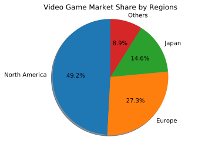
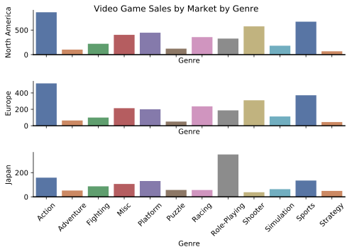
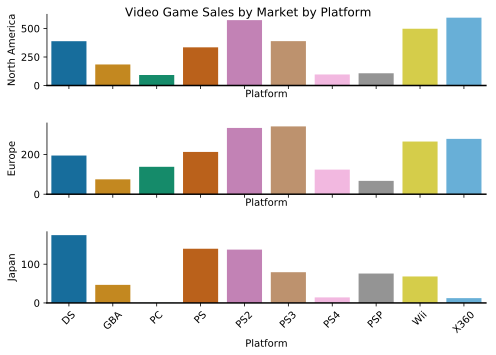
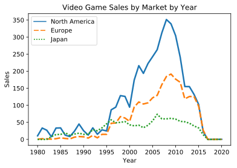

# Video Game Sales Analysis
### --- Data analysis with categorical variables.
This mini project analyzes video game sales across different markets: North America, Japan, and Europe within the last 30 years. The source data contains number of copies of games sold in each of the regional markets given information including game publisher, platform, year, genre, and name of the game.    
The repo contains two notebooks. **DataVisualization.ipynb** visualizes the data; **Regression.ipynb** runs a regression analysis to determine important features that affect video game sales. Feature selection is done using two methods: **forward selection using AIC** and **Lasso Regression**. The results are discussed in more details below.

### 1. Data visualization

The pie chart below shows the video game market share by regions.   

   
The bar plot below shows the video game sales of each genre in the 3 regional markets. Action, Sports, Shooter genres are more popular in North America and Europe but not as popular in Japan. Role play is popular in Japan but not in the other two markets.   

   
The bar plot below shows the distribution of video game sales on each platform in the 3 regional markets. Japan differs from the other two markets to a large extent, especially in DS, PC, PS, PS3, PS4, PSP, Wii, and X360.   

   
The line plot below shows the trend of video game sales across years in the 3 markets. (At a first glance, this looks like the sales volume of video games might be correlated with the macroeconomic healthiness. --- Financial crisis leads to unemployment; video game helps maintaining stress level and killing time...)   

   
 
 ### 2. Data analysis --- Regression with Categorical Variables
 In the notebook Regression.ipynb, linear regression is conducted using the categorical variables.  
 To select features from the whole set of 600+ features, I wrote a forward-selection function that uses AIC as a criterion to select features.  
 A Lasso Regression is also used to conduct feature selection.  
 Forward selection gives a model with 110 variables, whereas Lasso gives a model with 103 variables. 72 features are selected by both methods. 
 The regression model given by forward selection takes much longer time to run (more computation!) but gives a better model fitting result measured by R-squared, Adjusted R-squared, AIC, and BIC.
